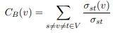
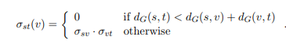
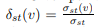
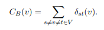
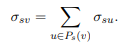
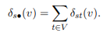
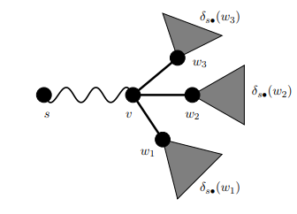
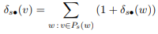
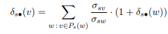

# Parallelizing the Graph Betweenness Centrality Calculation 

## Introduction
**Betweenness centrality** is a measure of centrality in a graph which is calculated based on the ratio of shortest paths passing through a particular vertex to the total number of shortest paths between all pairs of vertices.  
**Centrality** is the measure of importance of a vertex in a graph. Centrality is an important measure in various real world scenarios. For example, finding the best place to start a restaurant in a city, identifying an influential person in a social network, identifying the busiest server in a network etc. are all cases where centrality concept is necessary.  
In our endeavour we are only considering well connected unweighted graphs. The **Brandes algorithm**is asymptotically the best algorithm present to calculate the BC of the nodes in the graph. It has a run time of `O(n*m)` where n is the number of vertices and m is the number of edges in the graph.  
We aim to parallelise this algorithm on the CPU and the GPU using **OpenMP and CUDA** respecitvely.

## Necessary Preliminary Graph Definitions
Few graph definitions that we deemed necessary before tackling this problem. They are as follows: 
 1. The graph is represented as `G = (V,E)` where V is the set of vertices and E is the set of edges. The variables  `n=|V|` and  `m=|E|` represent the number of vertices and edges in the graph respectively.
 2. The *shortest path* between two vertices is the sequence of edges with the least number of edges within it.
 3. *Diameter* of the graph is the longest shortest path in G.
 4. BFS or *Breadth First Search* Algorithm:
    * It explores the graph starting from the source node and finds all vertices as a result finding the shortest path to the vertex from the source.
    * Each set of inspected vertices are known as the *vertex frontier* and thier outgoing edges are known as the *edge frontier*.
 5. Representation in memory:
    * Graphs are usually stored in the form of an adjacency matrix of size n*n, where A[i][j] will be 1 if there exists an edge between vertices i and j. However this matrix will be *sparse* as many of the cells will be 0.
    * Instead of using a 2D array with O(n^2) space complexity, the **Compressed Sparse Row (CSR)** format is used.
    * There are two 1D arrays present, the *row offsets (R)* and *column indices (C)*. R has a size of `n+1`.
    * Array R points at where each vertex's adjacency list beings and ends within the help of array C. For example, the adjacency list of a vertex u starts at `C[R[u]]` and ends at `C[R[u+1]−1]`. 

## BC Calculation - The Brandes Algorithm

1. The betweeness centrality each is found for each and every node in the graph G. BC for a node v is defined as the sum of the ratio of the number of shortest paths between a pair of nodes where v is present in the path to the number of shortest paths between the pair, mathematically give as:  
   
2. The **Belmann Criterion** states that the number of shortest paths between s and t with v in it is given as :  
   
3. So basically we have to find the number of shortest paths between each pai of nodes and sum up all the pair dependencies, where δst(v) is the pair dependecy between nodes s and t with v as intermediate node.  
     
   
4. How do we go about counting the number of paths between each pair? 
    1. The **BFS algorithm** for graphs does it in O(m) time for unweighted graphs. 
    2. It not only gives us the length of the shortest paths but also the **predcessor list** Ps(v) which contains all the nodes from which you can reach node v via a shortest path with s as the source node.
5. The combinatorial shortest-path counting formula is :  
   
6. In the Brandes algorithm, the concept of accumulation of pair dependecies was used. One node at a time is taken (basically one source node at a time in BFS, name it s) and all pair wise dependencies for node v are found with s as one of the pair members. This gives us a *dependency* of node s on v given as δs(v).  
   
7. The summation of all dependencies on v of every node in the graph will give us the value of CB(v).
8. How do we calculate δs(v)?
    1. Consider node s as the source and v as it's only neighbour, through which multiple shortest paths are present as shown in the figure.  
        
    2. The dependency can be easily given as :  
        
    3. If multiple shortest paths are present this can be generalised to :  
        

## GPU Parallelisation 

## CPU Parallelisation

## Results

## Conclusion

## References

